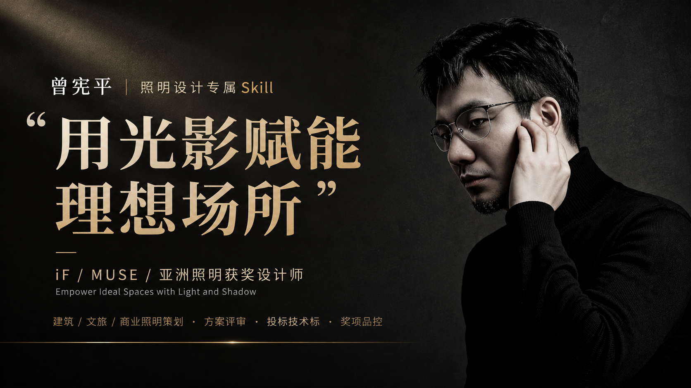

# 曾宪平 · 照明设计专属 Skill

<p align="center">
  
</p>

## 一句话介绍

曾宪平照明设计专属技能：凝练 iF / MUSE / 亚洲照明获奖设计师「用光影赋能理想场所」方法论，覆盖建筑文旅商业照明策划、方案评审、投标技术标与奖项品控全流程。

---

## 这是什么

这是一套为 **WorkBuddy** AI 助手设计的职业技能 Skill，将照明设计师 **曾宪平** 十六年实战经验沉淀为可调用的结构化知识库。

当 AI 在对话中遇到照明设计相关需求时，会自动加载此 Skill，以曾宪平的设计哲学和专业方法为指导输出方案。

## 核心能力

| 能力域 | 说明 |
|--------|------|
| 建筑照明 | 立面泛光、入口标识、夜间形象塑造 |
| 文旅夜游 | 文化院落、古建照明、主题叙事 |
| 商业综合体 | 购物中心、创客小镇、广场夜景 |
| 方案评审 | 设计合理性、技术可行性、造价评估 |
| 投标技术标 | 完整技术标书框架与内容生成 |
| 奖项品控 | iF / MUSE / 亚洲照明等申报品质把控 |

## 设计哲学

> **用光影赋能理想场所**

- 美学优先，工程可控
- 宁暗勿刺，防眩第一
- 分时分区，智能节能
- 每束光都有存在的理由

## 文件结构

```
zeng-xianping-lighting-skill/
├── SKILL.md                          # 主文件：身份、哲学、方法、原则
├── README.md                         # 本文件
├── assets/
│   └── cover.png                     # 封面图
└── references/
    └── lighting-expertise.md         # 深度参考：资质、作品、技术指标、避坑
```

## 如何使用

1. 将 `SKILL.md` 及 `references/` 目录安装到 WorkBuddy 的 skills 目录
2. 当对话涉及以下关键词时自动触发：
   - 照明设计 / 灯光设计 / 夜景照明 / **文旅夜游**
   - 曾宪平 / 筑影
   - 投标技术标（照明类）
   - 方案评审（照明类）
   - iF / MUSE / 亚洲照明（奖项申报）

## 关于曾宪平·设计师导

- 广东筑影文化科技集团 联合创始人 / 设计总监
- 筑影照明设计（广州）有限公司 总经理
- 高级照明设计师 / 国家国际照明设计师、注册工程师；亚洲照明设计协会认可专业人士
- 华南师范大学 环境艺术设计学士
- 代表作：珠海香洲埠文化院街、佛山 TIC 时代全球创客小镇、保利保奥广场、**云台山云溪谷文旅夜游**、**云南司岗里溶洞夜游**
- 荣誉：德国 iF 设计奖、美国 MUSE 铂金奖、亚洲照明设计奖「非凡之光」

## License

MIT

---
*Empower Ideal Spaces with Light and Shadow*
